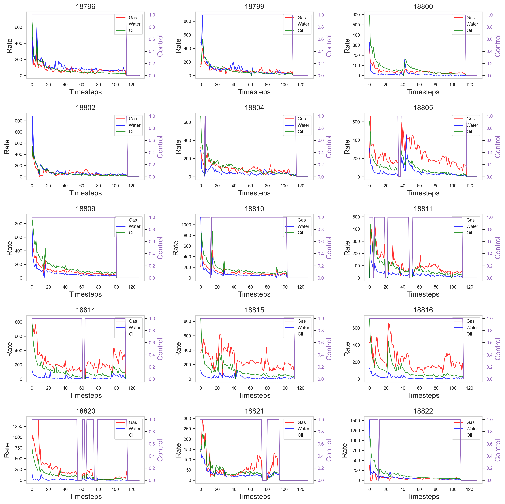
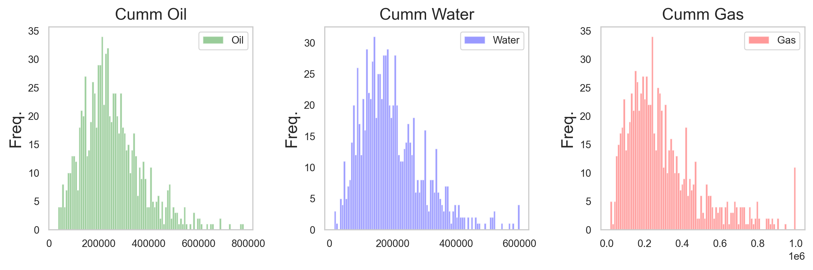
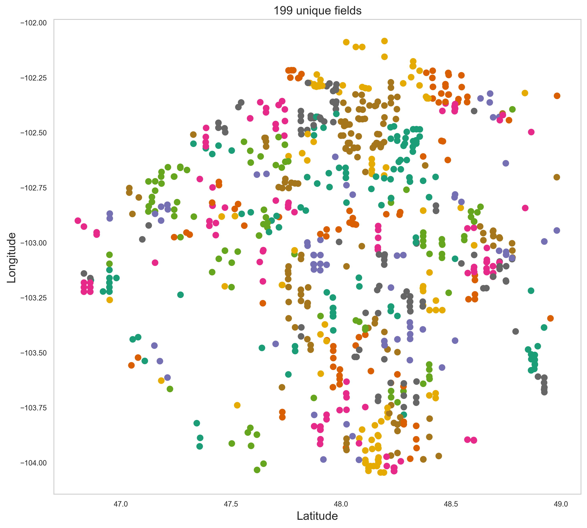
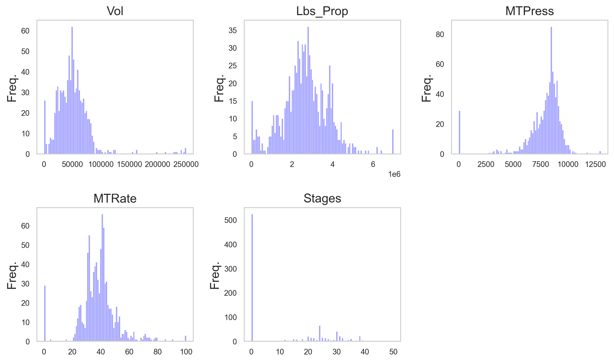
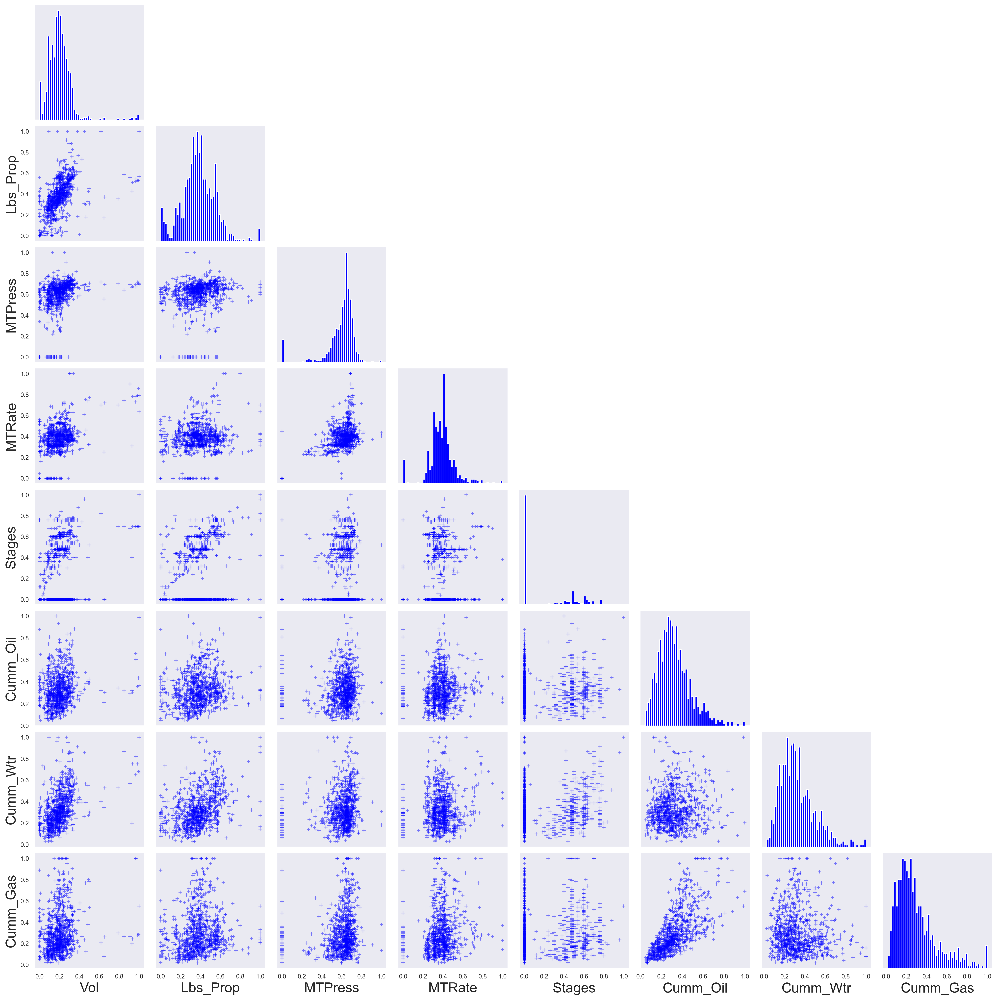
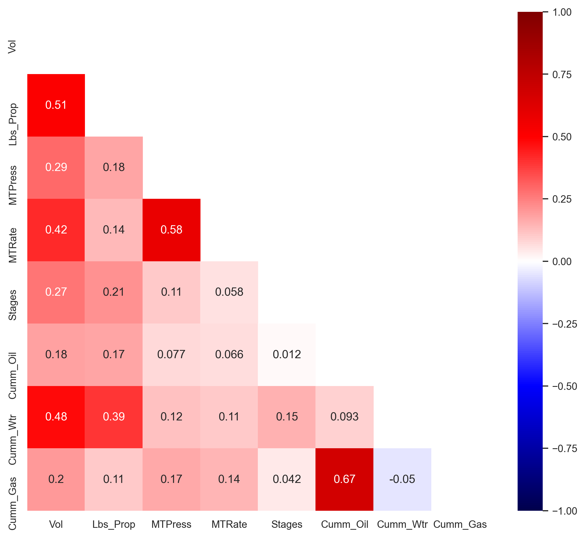

# Field data (Bakken)

Run these scripts in this order : `data_parse.ipynb` > `data_clean.ipynb` > `data_plot.ipynb`

| **DATA**         | Description| 
| :-------------   |-----------|
| `DATA-raw.pkl`   | Raw dict as extracted from the spreadsheet.|
| `DATA-clean.pkl` | Clean, imputed and outliers removed. |
| `DATA-norm.pkl`  | Normalized version, by features/channels.|

